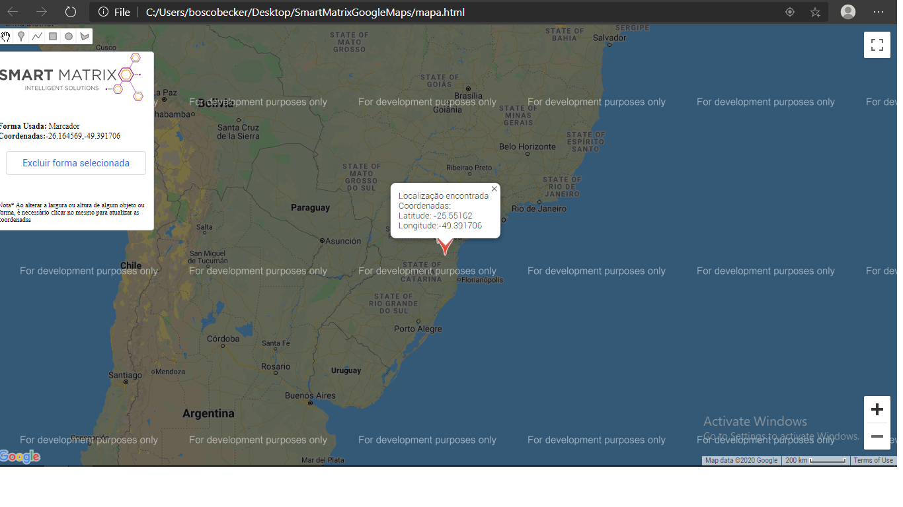

# SmartMatrix - API v3 Google Maps

# Projeto permite localização, usando API v3 do GoogleMaps
Nesse projeto é possível criar polígonos, realizar marcação e obter coordenadas usando TypeScript/Javascript.

# Sobre API V3 Google Maps

Este é um índice de todas as classes, métodos e interfaces no Maps JavaScript API versão 3.42 (canal semanal). Esta referência é mantida atualizada com as últimas alterações na API.

Sobre: https://developers.google.com/maps/documentation/javascript/reference

Make With Love - @boscobecker
